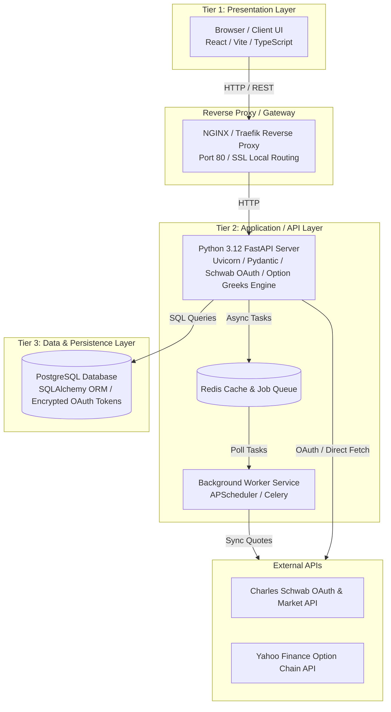

# PatelScope Architectural Blueprint (v2.0.0)
## Intranet 3-Tier Web Portal, Python FastAPI & DevOps CI/CD Pipeline

This document outlines the architecture for **PatelScope (v2.0.0)**, a **production-grade, 3-tier local intranet web application** powered by **Python FastAPI**, PostgreSQL, Docker containerization, automated CI/CD pipelines, and security scanning.

---

## 1. System Architecture: 3-Tier Production Design



### Component Breakdown

| Tier | Component | Technology Stack | Purpose |
| :--- | :--- | :--- | :--- |
| **Tier 1** | Presentation Layer | **React 19 / Vite / TypeScript** | Rich interactive financial UI with sliders, P&L graphs, holdings management, and options strategies. |
| **Ingress** | Reverse Proxy | **NGINX Container** | Handles local reverse proxying (`http://localhost/api/v1`), static routing, and SSL termination. |
| **Tier 2** | Service API | **Python 3.12 (FastAPI + Pydantic + Uvicorn)** | Enterprise REST API handling Schwab OAuth 2.0, option Greeks, Black-Scholes models, holdings CRUD, and simulation math. |
| **Tier 2** | Background Worker | **APScheduler / Celery + Redis** | Asynchronous Python worker service polling Schwab/Yahoo option chains and managing token auto-refreshes. |
| **Tier 3** | Database | **PostgreSQL (Dockerized) + SQLAlchemy ORM** | Industrial relational database with migration support (Alembic) and Fernet/AES-256 token encryption. |

---

## 2. Infrastructure & Local Container Setup

The entire local infrastructure is orchestrated using Docker Compose (`docker-compose.yml`):

1. **`portfolio_db`**: Postgres 16 container storing holdings, option contracts, and API credentials.
2. **`portfolio_redis`**: Redis 7 container handling caching for market quote feeds and option chains.
3. **`portfolio_api`**: Python 3.12 FastAPI container servicing `/api/v1/` REST endpoints.
4. **`portfolio_proxy`**: NGINX container routing traffic cleanly.

To start the infrastructure locally:
```bash
docker compose up --build -d
```

---

## 3. DevOps, CI/CD & Security Scanning Pipeline

Automated quality and security checks configured via GitHub Actions (`.github/workflows/ci.yml`):

1. **Secret Scanning**: TruffleHog scanner preventing API secrets or keys from being committed.
2. **Dependency Audit**: Python package audit scanning `requirements.txt` for vulnerabilities.
3. **PyTest Suite**: Unit and integration tests for FastAPI backend routes and options engines.
4. **Container Vulnerability Scanning**: Trivy scanner inspecting Docker images.
